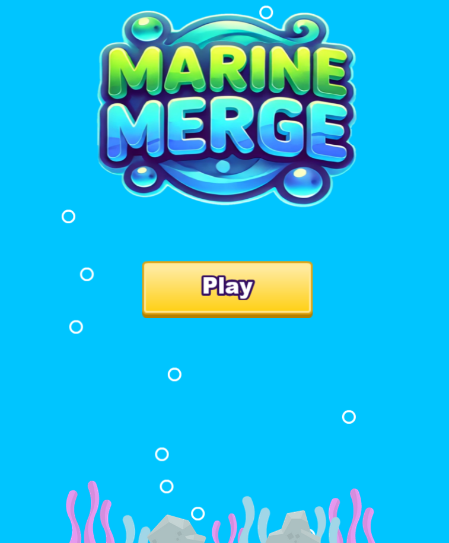
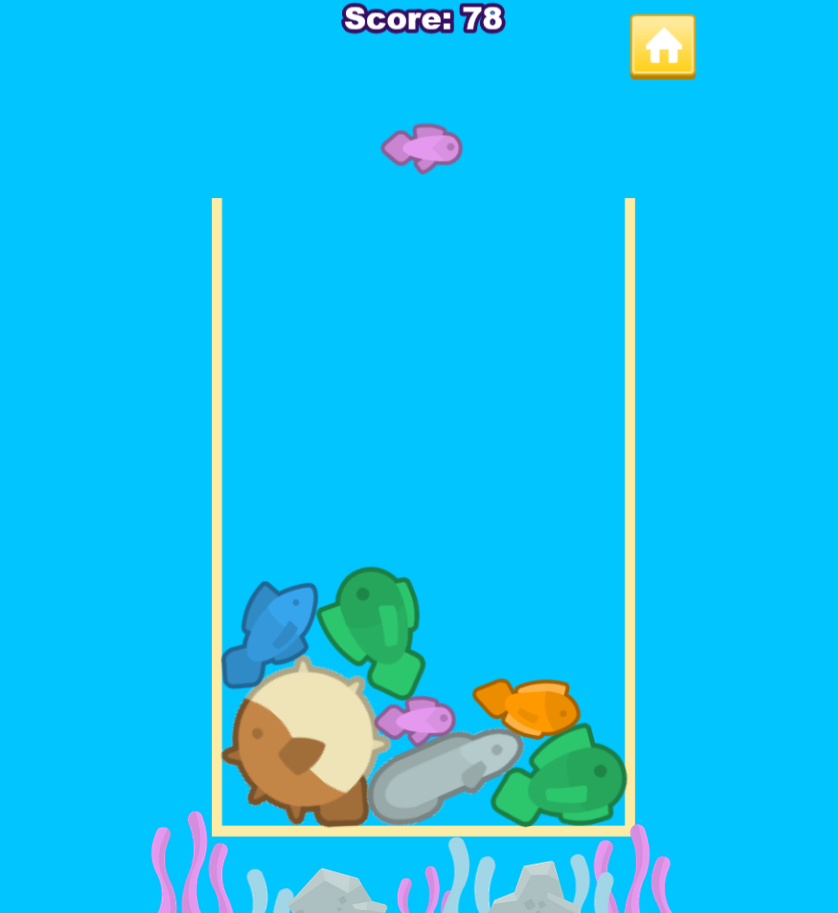

# Marine Merge

The game is playable [here!](https://ollipeltomaa.github.io/marine-merge/)

## Game idea
In this game your goal is to score points by merging two fish of the same kind. You can drop a fish into a container by left clicking the mouse or by tapping on the screen on mobile. You can move the fish that you drop horizontally by pressing the screen/keeping left mouse button pressed, and drop the fish at your desired location by releasing the mouse/taking the finger of the screen. When two fish merge, they combine into a bigger fish. The game ends when the container is full, and the fish in the container touch the fish about to be dropped next.

### Points from merging different kinds of fish
- Purple fish = 2 points
- Yellow fish = 4 points
- Blue fish = 6 points
- Green fish = 8 points
- Red fish = 10
- Gray fish = 12
- Blowfish = The last fish of the game, cannot be merged

## Technologies
- [Phaser 3](https://phaser.io/)
- [Typescript](https://www.typescriptlang.org/)

## Assets
- The fish, bubble and plant images are from Kenney's [fishpack](https://kenney.nl/assets/fish-pack). [CC0 licence](https://creativecommons.org/publicdomain/zero/1.0/).
- The UI elements are from Kenney's [UI Pack](https://kenney.nl/assets/ui-pack) and [Game Icons](https://kenney.nl/assets/game-icons) asset packs. [CC0 licence](https://creativecommons.org/publicdomain/zero/1.0/).